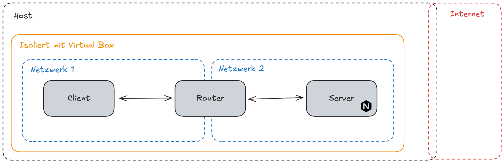

# Task 4 IT-Grundschutzkompendium

- [Purpose](#purpose)
- [Umgebung Aufgabe 1 \& 2](#umgebung-aufgabe-1--2)
- [Anwendbare Anforderungen](#anwendbare-anforderungen)
  - [OPS: Betrieb](#ops-betrieb)
    - [OPS.1.2.5 Fernwartung](#ops125-fernwartung)
  - [APP: Anwendungen](#app-anwendungen)
    - [APP.3.2 Webserver](#app32-webserver)
    - [APP.3.6 DNS-Server](#app36-dns-server)
  - [SYS: IT-Systeme](#sys-it-systeme)
    - [SYS.1.1 Allgemeiner Server](#sys11-allgemeiner-server)
    - [SYS.1.2.3 Windows Server](#sys123-windows-server)
    - [SYS.1.3 Server unter Linux und Unix](#sys13-server-unter-linux-und-unix)
    - [SYS.1.5 Virtualisierung](#sys15-virtualisierung)

## Purpose

## Umgebung Aufgabe 1 & 2

Die vorliegende Netzwerkarchitektur ist ein isoliertes Zwei-Segment-Netzwerk, das für Test- und Laborzwecke konzipiert wurde.
Es handelt sich um ein geschlossenes System, das keine direkte Verbindung zu externen Netzen wie dem Internet besitzt.

Der zentrale Knotenpunkt und das trennende Element ist der Router.
Dieser erfüllt die Rolle eines Gateways und teilt die Gesamtumgebung in zwei logisch getrennte Bereiche auf.
An der ersten Schnittstelle des Routers (Interface 1) ist das Netzwerk 1 angeschlossen.
Dieses erste Segment beherbergt den Client, welcher die Ausgangsstation für den Datenverkehr darstellt.
An der zweiten Schnittstelle des Routers (Interface 2) befindet sich das Netzwerk 2, in dem der Server angesiedelt ist.
Der Server dient als Zielsystem und stellt die zu testenden Dienste bereit (z. B. einen Webserver und einen DNS-Server, wie in den Labordaten beschrieben).

Der Router ist somit das einzige Verbindungselement zwischen Client und Server und muss für die Kommunikation zwischen den beiden Netzen (Net 1 und Net 2) konfiguriert werden.
Der Zweck dieser Segmentierung ist es, den Datenverkehr und die Sicherheitseinstellungen des Routers (z. B. Port-Weiterleitungen und Firewall-Regeln) präzise zwischen den beiden Systemen zu prüfen und zu steuern.

## Anwendbare Anforderungen

> Die Basis-Anforderungen stellen das Minimum dessen dar, was vernünftigerweise an Sicherheitsvorkehrungen umzusetzen ist. Als Einstieg kann sich die umsetzende Institution auf die Basis-Anforderungen beschränken, um so zeitnah die wirkungsvollsten Anforderungen zu erfüllen.

Als Einstieg wird sich auf die Basis-Anforderungen beschränkt.

### OPS: Betrieb

#### OPS.1.2.5 Fernwartung

> Mit dem Begriff Fernwartung wird ein zeitlich begrenzter Zugriff auf IT-Systeme und die darauf laufenden Anwendungen bezeichnet, der von einem anderen IT-System aus erfolgt. Der Zugriff kann z. B. dazu dienen, Konfigurations-, Wartungs- oder Reparaturarbeiten durchzuführen.

➜ Ansible

- [x] OPS.1.2.5.A1 Planung des Einsatzes der Fernwartung (B)

    > Der Einsatz der Fernwartung MUSS an die Institution angepasst werden. Die Fernwartung MUSS hinsichtlich technischer und organisatorischer Aspekte bedarfsgerecht geplant werden. Dabei MUSS mindestens berücksichtigt werden, welche IT-Systeme ferngewartet werden sollen und wer dafür zuständig ist.

    Es existieren klare verantwortlichkeiten, die Systeme werden über die `inventory.yaml` verwaltet.

- [x] OPS.1.2.5.A2 Sicherer Verbindungsaufbau bei der Fernwartung von Clients (B) [Benutzende]

    > Wird per Fernwartung auf Desktop-Umgebungen von Clients zugegriffen, MUSS die Fernwartungssoftware so konfiguriert sein, dass sie eine Verbindung erst nach expliziter Zustimmung der Benutzenden aufbaut.

    Entfällt

- [x] OPS.1.2.5.A3 Absicherung der Schnittstellen zur Fernwartung (B)

    > Die möglichen Zugänge und Kommunikationsverbindungen für die Fernwartung MÜSSEN auf das notwendige Maß beschränkt werden. Alle Fernwartungsverbindungen MÜSSEN nach dem Fernzugriff getrennt werden.
    >
    > Es MUSS sichergestellt werden, dass Fernwartungssoftware nur auf IT-Systemen installiert ist, auf denen sie benötigt wird.
    >
    > Fernwartungsverbindungen über nicht vertrauenswürdige Netze MÜSSEN verschlüsselt werden. Alle anderen Fernwartungsverbindungen SOLLTEN verschlüsselt werden.

  - [x] Fernwartung ist auf nötige Konfiguration beschränkt.
  - [x] Verbindung wird nach abschluss der Fernwartung getrennt.
  - [x] Keine Sofrware muss auf Systemen installiert werden (SSH ist auf Ubuntu standardmäßig verfügbar)
  - [x] SSH ist verschlüsselt

### APP: Anwendungen

#### APP.3.2 Webserver

- [ ] APP.3.2.A1 Sichere Konfiguration eines Webservers (B)

    > Nachdem der IT-Betrieb einen Webserver installiert hat, MUSS er eine sichere Grundkonfiguration vornehmen. Dazu MUSS er insbesondere den Webserver-Prozess einem Konto mit minimalen Rechten zuweisen. Der Webserver MUSS in einer gekapselten Umgebung ausgeführt werden, sofern dies vom Betriebssystem unterstützt wird. Ist dies nicht möglich, SOLLTE jeder Webserver auf einem eigenen physischen oder virtuellen Server ausgeführt wer- den.
    >
    > Dem Webserver-Dienst MÜSSEN alle nicht notwendige Schreibberechtigungen entzogen werden. Nicht benötigte Module und Funktionen des Webservers MÜSSEN deaktiviert werden

  - [x] Prozess ist durch eine VM abgekapselt
  - [x] Systemrechte sind durch sudo abgekapselt
  - Systeme verfügen jedoch über diverse zusätzliche Pakete, die nicht aktiv benötigt werden

  ➜ Härtung des Servers vornehmen und nicht genutzte Pakete entfernen
  ➜ Rechte weitestgehend einschränken, wie durch einen dedizierten Prozess User

- [ ] APP.3.2.A2 Schutz der Webserver-Dateien (B)

  > Der IT-Betrieb MUSS alle Dateien auf dem Webserver, insbesondere Skripte und Konfigurationsdateien, so schützen, dass sie nicht unbefugt gelesen und geändert werden können.
  >
  > Es MUSS sichergestellt werden, dass Webanwendungen nur auf einen definierten Verzeichnisbaum zugreifen können (WWW-Wurzelverzeichnis). Der Webserver MUSS so konfiguriert sein, dass er nur Dateien ausliefert, die sich innerhalb des WWW-Wurzelverzeichnisses befinden.
  >
  > Der IT-Betrieb MUSS alle nicht benötigten Funktionen, die Verzeichnisse auflisten, deaktivieren. Vertrauliche Daten MÜSSEN vor unberechtigtem Zugriff geschützt werden. Insbesondere MUSS der IT-Betrieb sicherstellen, dass vertrauliche Dateien nicht in öffentlichen Verzeichnissen des Webservers liegen. Der IT-Betrieb MUSS regelmäßig überprüfen, ob vertrauliche Dateien in öffentlichen Verzeichnissen gespeichert wurden.

  Ist nicht gegeben und nur im Rahmen einer Standardkonfiguration von `nginx`

  ➜ Sicherstellung der Zugriffe auf Dateien und Auflistungsfunktionen

- [x] APP.3.2.A3 Absicherung von Datei-Uploads und -Downloads (B)

  > Alle mithilfe des Webservers veröffentlichten Dateien MÜSSEN vorher auf Schadprogramme geprüft werden. Es MUSS eine Maximalgröße für Datei-Uploads spezifiziert sein. Für Uploads MUSS genügend Speicherplatz reserviert werden.

  Entfällt, keine Dateiuploads sind möglich.

- [ ] APP.3.2.A4 Protokollierung von Ereignissen (B)

  > Der Webserver MUSS mindestens folgende Ereignisse protokollieren:
  > - erfolgreiche Zugriffe auf Ressourcen,
  > - fehlgeschlagene Zugriffe auf Ressourcen aufgrund von mangelnder Berechtigung, nicht vorhandenen Ressourcen und Server-Fehlern sowie
  > - allgemeine Fehlermeldungen.
  >
  > Die Protokollierungsdaten SOLLTEN regelmäßig ausgewertet werden.

  - [x] Standardmäßige Logs von `nginx` aktiv
  - [ ] Auswertung findet nicht statt

  ➜ Auswertung der Logs entwerder durch manuelle betrachtung einführen oder ein dediziertes System, wie ein IDS oder eine dediziertes SIEM implementieren.

- [x] APP.3.2.A5 Authentisierung (B)

  > Wenn sich Clients mit Hilfe von Passwörtern am Webserver authentisieren, MÜSSEN diese kryptografisch gesichert und vor unbefugtem Zugriff geschützt gespeichert werden.

  Eine authentisieren ist nicht nötig, um mit dem Server zu kommunizieren.

- [x] APP.3.2.A7 Rechtliche Rahmenbedingungen für Webangebote (B) [Fachverantwortliche, Zentrale Verwaltung, Compliance-Beauftragte]

  > Werden über den Webserver Inhalte für Dritte publiziert oder Dienste angeboten, MÜSSEN dabei die relevanten rechtlichen Rahmenbedingungen beachtet werden. Die Institution MUSS die jeweiligen Telemedien- und Datenschutzgesetze sowie das Urheberrecht einhalten.

  Trifft nicht zu.

- [x] APP.3.2.A11 Verschlüsselung über TLS (B)

  > Der Webserver MUSS für alle Verbindungen durch nicht vertrauenswürdige Netze  eine sichere Verschlüsselung über TLS anbieten (HTTPS). Falls es aus  Kompatibilitätsgründen erforderlich ist, veraltete Verfahren zu verwenden, SOLLTEN diese auf so wenige Fälle wie möglich beschränkt werden.
  >
  > Wenn eine HTTPS-Verbindung genutzt wird, MÜSSEN alle Inhalte über HTTPS  ausgeliefert werden. Sogenannter Mixed Content DARF NICHT verwendet werden.

  Webserver erzwingt reines HTTPS.

#### APP.3.6 DNS-Server

- [ ] APP.3.6.A1 Planung des DNS-Einsatzes (B)

  > Der Einsatz von DNS-Servern MUSS sorgfältig geplant werden. Es MUSS zuerst festgelegt werden, wie der Netzdienst DNS aufgebaut werden soll. Es MUSS festgelegt werden, welche Domain-Informationen schützenswert sind. Es MUSS geplant werden, wie DNS-Server in das Netz des Informationsverbunds eingebunden werden sollen. Die getroffenen Entscheidungen MÜSSEN geeignet dokumentiert werden.

  Es wurde nichts dazu dokumentiert und eine sorgfältige Planung fand nicht statt.

  ➜ Überarbeitung des ursprünglichen Konzepts mit einer geeigneten Ausarbeitung, die ebenfalls dokumentiert wird.

- [ ] APP.3.6.A2 Einsatz redundanter DNS-Server (B)

  > Advertising DNS-Server MÜSSEN redundant ausgelegt werden. Für jeden Advertising DNS-Server MUSS es mindestens einen zusätzlichen Secondary DNS-Server geben.

  Es existiert keine Redundanz.

  ➜ Hinzufügen eines redundanten DNS-Servers

- [x] APP.3.6.A3 Verwendung von separaten DNS-Servern für interne und externe Anfragen (B)

  > Advertising DNS-Server und Resolving DNS-Server MÜSSEN serverseitig getrennt sein. Die Resolver der internen IT-Systeme DÜRFEN NUR die internen Resolving DNS-Server verwenden.

  Nicht anwendbar, da das System komplett von externen Netzen abgeschottet ist.

- [x] APP.3.6.A4 Sichere Grundkonfiguration eines DNS-Servers (B)

  > Ein Resolving DNS-Server MUSS so konfiguriert werden, dass er ausschließlich Anfragen aus dem internen Netz akzeptiert. Wenn ein Resolving DNS-Server Anfragen versendet, MUSS er zufällige Source Ports benutzen. Sind DNS-Server bekannt, die falsche Domain-Informationen liefern, MUSS der Resolving DNS-Server daran gehindert werden, Anfragen dorthin zu senden. Ein Advertising DNS-Server MUSS so konfiguriert werden, dass er Anfragen aus dem Internet immer iterativ behandelt.
  >
  > Es MUSS sichergestellt werden, dass DNS-Zonentransfers zwischen Primary und Secondary DNS-Servern funktionieren. Zonentransfers MÜSSEN so konfiguriert werden, dass diese nur zwischen Primary und Secondary DNS-Servern möglich sind. Zonentransfers MÜSSEN auf bestimmte IP-Adressen beschränkt werden. Die Version des verwendeten DNS-Server-Produktes MUSS verborgen werden.

  - [x] Größtenteils durch standard Konfiguration gegeben
  - [ ] Secondary DNS-Servern existert nicht

  ➜ Hinzufügen eines redundanten DNS-Servers und dessen konfiguration sicherstellen

- [x] APP.3.6.A6 Absicherung von dynamischen DNS-Updates (B)

  > Es MUSS sichergestellt werden, dass nur legitimierte IT-Systeme Domain-Informationen ändern dürfen. Es MUSS festgelegt werden, welche Domain-Informationen die IT-Systeme ändern dürfen.

  Handelt sich um einen reinen internen DNS Server, ist gegeben

- [ ] APP.3.6.A7 Überwachung von DNS-Servern (B)

  > DNS-Server MÜSSEN laufend überwacht werden. Es MUSS überwacht werden, wie ausgelastet die DNS-Server sind, um rechtzeitig die Leistungskapazität der Hardware anpassen zu können. DNS-Server MÜSSEN so konfiguriert werden, dass mindestens die folgenden sicherheitsrelevanten Ereignisse protokolliert werden:
  > - Anzahl der DNS-Anfragen,
  > - Anzahl der Fehler bei DNS-Anfragen,
  > - EDNS-Fehler (EDNS – Extension Mechanisms for DNS),
  > - auslaufende Zonen sowie
  > - fehlgeschlagene Zonentransfers.

  Überwachung findet aktuell nicht aktiv statt

  ➜ Überprüfung und Korrektur der Loggingfunktionen des DNS-Servers

- [ ] APP.3.6.A8 Verwaltung von Domainnamen (B) [Zentrale Verwaltung]

  > Es MUSS sichergestellt sein, dass die Registrierungen für alle Domains, die von einer Institution benutzt werden, regelmäßig und rechtzeitig verlängert werden. Eine Person MUSS bestimmt werden, die dafür zuständig ist, die Internet-Domainnamen zu verwalten. Falls Dienstleistende mit der Domainverwaltung beauftragt werden, MUSS darauf geachtet werden, dass die Institution die Kontrolle über die Domains behält.

  Domäne ist nicht registriert

  ➜ Registrierung der Domäne bei einem Dienstleister

- [ ] APP.3.6.A9 Erstellen eines Notfallplans für DNS-Server (B)

  > Ein Notfallplan für DNS-Server MUSS erstellt werden. Der Notfallplan für DNS-Server MUSS in die bereits vorhandenen Notfallpläne der Institution integriert werden. Im Notfallplan für DNS-Server MUSS ein Datensicherungskonzept für die Zonen- und Konfigurationsdateien beschrieben sein. Das Datensicherungskonzept für die Zonen- und Konfigurationsdateien MUSS in das existierende Datensicherungskonzept der Institution integriert werden. Der Notfallplan für DNS-Server MUSS einen Wiederanlaufplan für alle DNS-Server im Informationsverbund enthalten.

  Es existert kein Notfallplan

  ➜ Erstellung eines Notfallplans

### SYS: IT-Systeme

#### SYS.1.1 Allgemeiner Server

- [ ] SYS.1.1.A1 Zugriffsschutz und Nutzung (B)

  > Physische Server MÜSSEN an Orten betrieben werden, zu denen nur berechtigte  Personen Zutritt haben. Physische Server MÜSSEN daher in Rechenzentren,  Serverräumen oder abschließbaren Serverschränken aufgestellt beziehungsweise  eingebaut werden (siehe hierzu die entsprechenden Bausteine der Schicht INF  Infrastruktur). Bei virtualisierten Servern MUSS der Zugriff auf die Ressourcen  der Instanz und deren Konfiguration ebenfalls auf die berechtigten Personen  begrenzt werden.
  > Server DÜRFEN NICHT als Arbeitsplatzrechner genutzt werden. Server DÜRFEN  NICHT zur Erledigung von Aufgaben und Tätigkeiten verwendet werden, die  grundsätzlich auf einem Client-System aus- und durchgeführt werden können.  Insbesondere DÜRFEN vorhandene Anwendungen, wie Webbrowser, auf dem Server NICHT  für das Abrufen von Informationen aus dem Internet oder das Herunterladen von  Software, Treibern und Updates verwendet werden.
  >
  > Als Arbeitsplatz genutzte IT-Systeme DÜRFEN NICHT als Server genutzt werden.

  - [ ] Server laufen aktuell als VM auf einem Arbeitsrechner
  - [ ] Jeder der den Rechner nutzt kann automatisch auf die VMs zugreifen

  ➜ Insolierung durch einen physischen Server mit regulierten Zugriffen auf die VMs

- [ ] SYS.1.1.A2 Authentisierung an Servern (B)

  > Für die Anmeldung von Benutzenden und Diensten am Server MÜSSEN Authentisierungsverfahren eingesetzt werden, die dem Schutzbedarf der Server angemessen sind. Dies SOLLTE in besonderem Maße für administrative Zugänge berücksichtigt werden. Soweit möglich, SOLLTE dabei auf zentrale, netzbasierte Authentisierungsdienste zurückgegriffen werden.

  ➜ Einfürung eines zentralen netzbasierten Authentisierungsdienst

- [ ] SYS.1.1.A5 Schutz von Schnittstellen (B)

  > Es MUSS gewährleistet werden, dass nur dafür vorgesehene Wechselspeicher und sonstige Geräte an die Server angeschlossen werden können. Alle Schnittstellen, die nicht verwendet werden, MÜSSEN deaktiviert werden.

  ➜ Deaktivierung der guest additions auf den VMs, beim physischen Server ebenfalls im BIOS jegliche nicht verwendeten Schnitstellen deaktivieren

- [x] SYS.1.1.A6 Deaktivierung nicht benötigter Dienste (B)

  > Alle nicht benötigten Serverrollen, Features und Funktionen, sonstige Software und Dienste MÜSSEN deaktiviert oder deinstalliert werden, vor allem Netzdienste. Auch alle nicht benötigten Funktionen in der Firmware MÜSSEN deaktiviert werden. Die Empfehlungen des Betriebssystemherstellers SOLLTEN hierbei als Orientierung berücksich- tigt werden.
  >
  > Auf Servern SOLLTE der Speicherplatz für die einzelnen Benutzenden, aber auch für Anwendungen, geeignet beschränkt werden.
  >
  > Die getroffenen Entscheidungen SOLLTEN so dokumentiert werden, dass nachvollzogen werden kann, welche Konfiguration und Softwareausstattung für die Server gewählt wurden.

  - [x] Betriebstsysteme wurden in minimaler Standardausführung installiert und nur benötigte Software wurde nachistalliert.
  - [x] Speicher ist in VMs auf minimal benötigte Kapazität für den Betrieb beschränkt
  - [ ] Server werden über IaC konfiguriert, der Code dient dabei als Dokumentation

- [x] SYS.1.1.A9 Einsatz von Virenschutz-Programmen auf Servern (B)

  > Abhängig vom installierten Betriebssystem, den bereitgestellten Diensten und von anderen vorhandenen Schutzmechanismen des Servers MUSS geprüft werden, ob Viren-Schutzprogramme eingesetzt werden sollen und können. Soweit vorhanden, MÜSSEN konkrete Aussagen, ob ein Virenschutz notwendig ist, aus den betreffenden Betriebssystem-Bausteinen des IT-Grundschutz-Kompendiums berücksichtigt werden.

  Ein Virenschutz ist wird auf den reinen Ausgabe Servern als nicht notwendig gesehen, da kontrolliert werden kann wer was auf den Systemen isntalliert.
  Die Systeme werden auf andere Weisen außerden weiter gehärtet.

  Ein Virenschutzprogramm stellt in diesem Kontext nur eine weitere Abhängigkeit oder sogar ein Einfallstor dar.

- [x] SYS.1.1.A10 Protokollierung (B)

  > Generell MÜSSEN alle sicherheitsrelevanten Systemereignisse protokolliert werden, dazu gehören mindestens:
  > - Systemstarts und Reboots,
  > - erfolgreiche und erfolglose Anmeldungen am IT-System (Betriebssystem und Anwendungssoftware),
  > - fehlgeschlagene Berechtigungsprüfungen,
  > - blockierte Datenströme (Verstöße gegen ACLs oder Firewallregeln),
  > - Einrichtung oder Änderungen von Benutzenden, Gruppen und Berechtigungen,
  > - sicherheitsrelevante Fehlermeldungen (z. B. Hardwaredefekte, Überschreitung von Kapazitätsgrenzen) sowie
  > - Warnmeldungen von Sicherheitssystemen (z. B. Virenschutz).

  Die Betriebssysteme stellen diese Logs in ausreichender Form zur verfügung.

#### SYS.1.2.3 Windows Server

- [x] SYS.1.2.3.A1 Planung von Windows Server (B)

  > Es MUSS eine begründete und dokumentierte Entscheidung für eine geeignete Edition von Windows Server getroffen werden. Der Einsatzzweck des Servers sowie die Einbindung ins Active Directory MÜSSEN dabei spezifiziert werden. Die Nutzung von mitgelieferten Cloud-Diensten im Betriebssystem MUSS grundsätzlich abgewogen und gründlich geplant werden. Wenn nicht benötigt, MUSS die Einrichtung von Microsoft-Konten auf dem Server blockiert werden.

  - [x] Die entscheidung ist durch die Aufgabenstellung begründet
  - [x] Es wurden standardmäßig keine Microsoft Konten verwendet

- [ ] SYS.1.2.3.A2 Sichere Installation von Windows Server (B)

  > Wenn vom Funktionsumfang her ausreichend, MUSS die Server-Core-Variante installiert werden. Andernfalls MUSS begründet werden, warum die Server-Core-Variante nicht genügt.

  - [ ] Server wurden nicht in der Secure-Core-Variante installiert

  ➜ Reinstallierung der Server in der Secure-Core-Variante

- [x] SYS.1.2.3.A3 Telemetrie- und Nutzungsdaten unter Windows Server (B)

  > Um die Übertragung von Diagnose- und Nutzungsdaten an Microsoft stark zu reduzieren, MUSS das Telemetrie-Level 0 (Security) auf dem Windows Server konfiguriert werden. Wenn diese Einstellung nicht wirksam umgesetzt wird, dann MUSS durch geeignete Maßnahmen, etwa auf Netzebene, sichergestellt werden, dass die Daten nicht an den Hersteller übertragen werden.

  - [x] Diagnose Daten wurden auf unbedingt notwendige eingeschränkt

#### SYS.1.3 Server unter Linux und Unix

- [x] SYS.1.3.A2 Sorgfältige Vergabe von IDs (B)

  > Jeder Login-Name, jede User-ID (UID) und jede Gruppen-ID (GID) DARF NUR einmal vorkommen. Jedes Konto von Benutzenden MUSS Mitglied mindestens einer Gruppe sein. Jede in der Datei /etc/passwd vorkommende GID MUSS in der Datei /etc/group definiert werden. Jede Gruppe SOLLTE nur die Konten enthalten, die unbedingt notwendig sind. Bei vernetzten Systemen MUSS außerdem darauf geachtet werden, dass die Vergabe von Benutzenden- und Gruppennamen, UID und GID im Systemverbund konsistent erfolgt, wenn beim systemübergreifenden Zugriff die Möglichkeit besteht, dass gleiche UIDs bzw. GIDs auf den Systemen unterschiedlichen Benutzenden- bzw. Gruppennamen zugeordnet werden könnten.

  - [x] Ist gegeben, da nur ein Standardaccount existiert

- [ ] SYS.1.3.A3 Kein automatisches Einbinden von Wechsellaufwerken (B)

  > Wechseldatenträger wie z. B. USB-Sticks oder CDs/DVDs DÜRFEN NICHT automatisch eingebunden werden.

  - [ ] Das automatische Einbinden von Wechseldatenträgern ist aktiviert

  ➜ Automatisches Einbinden von Wechseldatenträgern deaktivieren durch entfernen der Guest Additions

- [ ] SYS.1.3.A4 Schutz vor Ausnutzung von Schwachstellen in Anwendungen (B)

  > Um die Ausnutzung von Schwachstellen in Anwendungen zu erschweren, MUSS ASLR und DEP/NX im Kernel aktiviert und von den Anwendungen genutzt werden. Sicherheitsfunktionen des Kernels und der Standardbibliotheken, wie z. B. Heap- und Stackschutz, DÜRFEN NICHT deaktiviert werden.

  - [ ] ASLR und/oder DEP/NX sind im Kernel deaktiviert

  ➜ ASLR und DEP/NX im Kernel aktivieren

  - [ ] Sicherheitsfunktionen des Kernels/der Standardbibliotheken sind deaktiviert

  ➜ Deaktivierte Sicherheitsfunktionen (Heap-, Stackschutz o. ä.) reaktivieren

- [ ] SYS.1.3.A5 Sichere Installation von Software-Paketen (B)
  > Wenn zu installierende Software aus dem Quellcode kompiliert werden soll, DARF diese NUR unter einem unprivilegierten Konto entpackt, konfiguriert und übersetzt werden. Anschließend DARF die zu installierende Software NICHT unkontrolliert in das Wurzeldateisystem des Betriebssystems installiert werden. Wird die Software aus dem Quelltext übersetzt, SOLLTEN die gewählten Parameter geeignet dokumentiert werden. Anhand dieser Dokumentation SOLLTE die Software jederzeit nachvollziehbar und reproduzierbar kompiliert werden können. Alle weiteren Installationsschritte SOLLTEN dabei ebenfalls dokumentiert werden.
  - [ ] Kompilierung aus Quellcode erfolgte unter privilegiertem Konto

  ➜ Prozess zur Kompilierung anpassen, sodass nur ein unprivilegiertes Konto verwendet wird

  - [x] Software wurde kontrolliert in die Verzeichnisstruktur integriert
  - [x] Dokumentation der gewählten Kompilierungsparameter ist durch IaC gegeben
  - [x] Installationsschritte nach der Kompilierung werden durch IaC sichergestellt

#### SYS.1.5 Virtualisierung

- [ ] SYS.1.5.A2 Sicherer Einsatz virtueller IT-Systeme (B)
  > Jede Person, die virtuelle IT-Systeme administriert, MUSS wissen, wie sich eine Virtualisierung auf die betriebenen IT-Systeme und Anwendungen auswirkt. Die Zugriffsrechte für Administrierende auf virtuelle IT-Systeme MÜSSEN auf das tatsächlich notwendige Maß reduziert sein. Es MUSS gewährleistet sein, dass die für die virtuellen IT-Systeme notwendigen Netzverbindungen in der virtuellen Infrastruktur verfügbar sind. Auch MUSS geprüft werden, ob die Anforderungen an die Isolation und Kapselung der virtuellen IT-Systeme sowie der darauf betriebenen Anwendungen hinreichend erfüllt sind. Weiterhin MÜSSEN die eingesetzten virtuellen IT-Systeme den Anforderungen an die Verfügbarkeit und den Datendurchsatz genügen. Im laufenden Betrieb MUSS die Performance der virtuellen IT-Systeme überwacht werden.
  - [x] Administrator verfügt über das gesamte Wissen der IT-Infrastruktur
  - [ ] Zugriffsrechte für Administratoren sind nicht auf das notwendige Maß reduziert

  ➜ Zugriffsrechte nach dem "Need-to-Know"-Prinzip auf das notwendige Minimum beschränken

  - [x] Notwendige Netzverbindungen für virtuelle IT-Systeme in der virtuellen Infrastruktur sind verfügbar
  - [x] Isolation und Kapselung der virtuellen IT-Systeme/Anwendungen ist duch komplette isolation des Netzwerkes und der einzelnen VMs gegeben
  - [ ] Virtuelle IT-Systeme erfüllen nicht die Anforderungen an Verfügbarkeit und Datendurchsatz

  ➜ Ressourcenanforderungen (CPU, RAM, Storage, Netzwerk) prüfen und anpassen, um Verfügbarkeit und Datendurchsatz zu gewährleisten

  - [x] Performance der virtuellen IT-Systeme wird im laufenden Betrieb ausführlich durch den Taskmanager überwacht aufgrund von RAM Angst

- [ ] SYS.1.5.A3 Sichere Konfiguration virtueller IT-Systeme (B)

  > Gast-Systeme DÜRFEN NICHT auf Geräte und Schnittstellen des Virtualisierungsservers zugreifen. Ist eine solche Verbindung jedoch notwendig, MUSS diese exklusiv zugeteilt werden. Sie DARF NUR für die notwendige Dauer von den Administrierenden des Host-Systems hergestellt werden. Dafür MÜSSEN verbindliche Regelungen festgelegt werden. Virtuelle IT-Systeme SOLLTEN nach den Sicherheitsrichtlinien der Institution konfiguriert und geschützt werden.

  - [ ] Gast-Systeme können auf Geräte und Schnittstellen des Virtualisierungsservers zugreifen

  ➜ Zugriffe von Gast-Systemen auf Host-Geräte und Schnittstellen unterbinden durch korrekte Einstellung der Guest Additions

  - [ ] Notwendige exklusive Zuteilungen erfolgen nicht durch Host-Administratoren oder sind zeitlich nicht begrenzt

  ➜ Verfahren für exklusive Zuteilungen definieren, auf das notwendige Minimum reduzieren und protokollieren

  - [ ] Verbindliche Regelungen für die Herstellung notwendiger Verbindungen fehlen

  ➜ Regelungen festlegen

  - [ ] Konfiguration virtueller IT-Systeme entspricht nicht den Sicherheitsrichtlinien der Institution

  ➜ Wird durch die Implementierung der in diesem Dokument gestellten Forderungen umgesetzt

- [x] SYS.1.5.A4 Sichere Konfiguration eines Netzes für virtuelle Infrastrukturen (B)

  > Es MUSS sichergestellt werden, dass bestehende Sicherheitsmechanismen (z. B. Firewalls) und Monitoring-Systeme nicht über virtuelle Netze umgangen werden können. Auch MUSS ausgeschlossen sein, dass über virtuelle IT-Systeme, die mit mehreren Netzen verbunden sind, unerwünschte Netzverbindungen aufgebaut werden können. Netzverbindungen zwischen virtuellen IT-Systemen und physischen IT-Systemen sowie für virtuelle Firewalls SOLLTEN gemäß den Sicherheitsrichtlinien der Institution konfiguriert werden.

  - [x] Sicherheitsmechanismen liegen auf den jeweiligen VMs und sind für alle virtuellen Netzwerkadapter konfiguriert
  - [x] Virtuelle Maschinen liegen in dedizierten Netzten und sind entsprechend isoliert
  - [x] Netzverbindungen zwischen virtuellen/physischen Systemen oder virtuellen Firewalls wurden entsprechend den Sicherheitsrichtlinien (die Aufgabenstellung) konfiguriert

- [x] SYS.1.5.A5 Schutz der Administrationsschnittstellen (B)

  > Alle Administrations- und Management-Zugänge zum Managementsystem und zu den Host-Systemen MÜSSEN eingeschränkt werden. Es MUSS sichergestellt sein, dass aus nicht-vertrauenswürdigen Netzen heraus nicht auf die Administrationsschnittstellen zugegriffen werden kann. Um die Virtualisierungsserver oder die Managementsysteme zu administrieren bzw. zu überwachen, SOLLTEN als sicher geltende Protokolle eingesetzt werden. Sollte dennoch auf unsichere Protokolle zurückgegriffen werden, MUSS für die Administration ein eigenes Administrationsnetz genutzt werden.

  Durch die isolation der Netzwerke ist ein Zugriff nur innerhalb des Netzwerks möglich

- [ ] SYS.1.5.A6 Protokollierung in der virtuellen Infrastruktur (B)

  > Betriebszustand, Auslastung und Netzanbindungen der virtuellen Infrastruktur MÜSSEN laufend protokolliert werden. Werden Kapazitätsgrenzen erreicht, SOLLTEN virtuelle Maschinen verschoben werden. Zudem SOLLTE eventuell die Hardware erweitert werden. Auch MUSS überwacht werden, ob die virtuellen Netze den jeweiligen virtuellen IT-Systemen korrekt zugeordnet sind.

  - [ ] Betriebszustand, Auslastung und Netzanbindungen der virtuellen Infrastruktur werden nicht laufend protokolliert

  ➜ Laufende Protokollierung von Betriebszustand, Auslastung und Netzanbindungen implementieren

  - [ ] Kapazitätsgrenzen werden erreicht, ohne dass virtuelle Maschinen verschoben oder Hardware erweitert wird

  ➜ Prozesse zur Kapazitätsplanung und -reaktion (VM-Verschiebung, Hardware-Erweiterung) definieren und durchführen

  - [ ] Überwachung der korrekten Zuordnung virtueller Netze zu virtuellen IT-Systemen fehlt

  ➜ Überwachung der Netzzuordnung implementieren und sicherstellen

- [x] SYS.1.5.A7 Zeitsynchronisation in virtuellen IT-Systemen (B)

  > Die Systemzeit aller produktiv eingesetzten virtuellen IT-Systeme MUSS immer synchron sein.

  Es gibt keine produktiven Umgebungen
