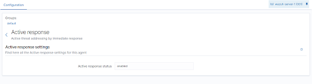

# Task 7 SIEM

After a very long local installation session... Wazuh cloud in the trial was chosen.

Wazuh server is here: <https://1ptzwop18fnw.cloud.wazuh.com>

With the instructions in wazuh cloud the agent was installed on the test VM.

Simulate ssh brute force attack with:

```bash
hydra -l ubuntu -P rockyou.txt 192.168.178.51 ssh
```

> Got the wordlist from here: <https://github.com/teamstealthsec/wordlists>

Configure active response for brute force attack by adding the following block to the `ossec.conf`.

> Server -> Settings -> Button Edit

```xml
<active-response>
  <command>firewall-drop</command>
  <location>local</location>
  <rules_id>5758, 5763, 5551, 40111</rules_id>
  <timeout>300</timeout>
</active-response>
```

Ensure that active response is enabled on the agent!



Aaaaand then you will see that the connection is dropped for 300 s:
